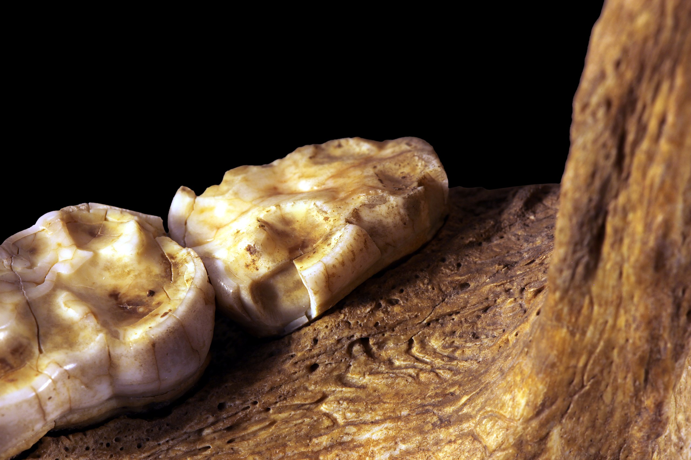
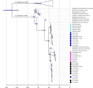
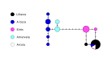
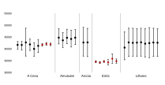
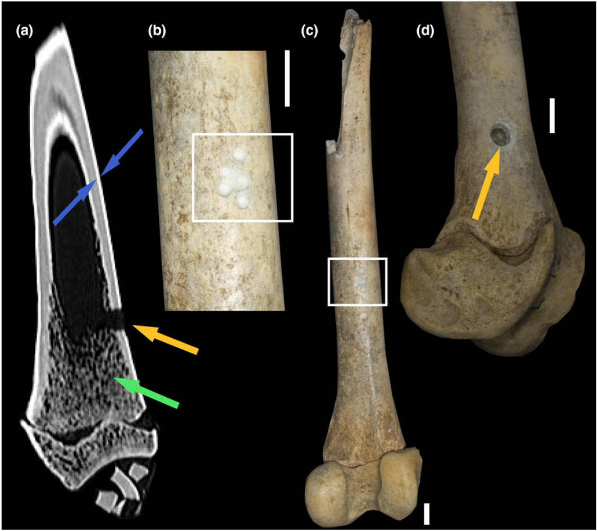
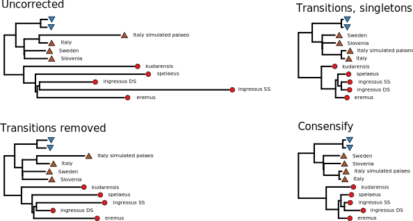
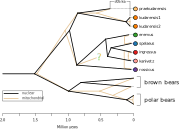
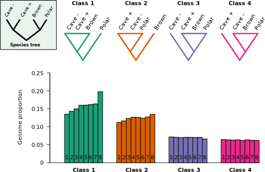

```{r setup, include = FALSE}
library(tidyverse)
library(RColorBrewer)
library(knitr)
```

<!-- adding bold and italic options -->
<style>
em {
  font-style: italic
}
strong {
  font-weight: bold;
}
</style>

## Discoveries facilitated by ancient DNA

- Cave bear homing behaviour
- Cave bear phylogeny
- Cave bear admixture


```{r, out.width = "60%", dpi = 300, fig.align = "right", echo = FALSE}
include_graphics("./assets/img/brown-bear-4248371.png")
```

--- .segue .dark 

## Cave bear!

--- &twocol

## Cave bears (*Ursus spelaeus* complex)

*** =left

```{r, out.width = "100%", dpi = 300, echo = FALSE}
include_graphics("./assets/img/Ursus_spelaeus_Sergiodlarosa.jpg")
```
*Sergiodlarosa, CC BY-SA 3.0*

```{r, out.width = "35%", dpi = 300, echo = FALSE}
include_graphics("./assets/img/sp_tree.svg")
```

*** =right

```{r, out.width = "100%", dpi = 300, echo = FALSE}
include_graphics("./assets/img/kudarensis.png")
```

```{r, out.width = "70%", dpi = 300, fig.align = "center", echo = FALSE}
  
```
*Rama pour Wikimédia France, CC BY-SA 2.0 FR*

--- &twocol

## Cave bear caves

*** =left

```{r, out.width = "100%", dpi = 300, echo = FALSE}
include_graphics("./assets/img/Ker_de_MASSAT_1.jpg")
```
*PierreG 09, CC BY-SA 4.0*

*** =right

```{r, out.width = "100%", dpi = 300, echo = FALSE}
include_graphics("./assets/img/2560px-Teufelshöhle_bear_bones_17RM1090-PSD.jpg")
```
*Ermell, CC BY-SA 4.0*

--- &thirds

## Cave bear caves

*** =right

```{r, out.width = "100%", dpi = 300, echo = FALSE}
include_graphics("./assets/img/Medvebarlang04.jpg")
```
*Zátonyi Sándor, (ifj.) Fizped, CC BY-SA 3.0*

*** =left

```{r, out.width = "100%", dpi = 300, echo = FALSE}
include_graphics("./assets/img/cave_bear_scratches.jpg")
```

*JYB Devot, CC BY-SA 4.0*

--- &twocol

## Cave bears and humans

*** =left

```{r, out.width = "100%", dpi = 300, echo = FALSE}
include_graphics("./assets/img/Cave-Bears-Chauvet-painting-1.jpg")
```
*Late Pleistocene human*

*** =right

```{r, out.width = "100%", dpi = 300, echo = FALSE}
  include_graphics("./assets/img/(Toulouse)_Dent_d'ours.jpg")
```
*Didier Descouens, CC BY-SA 4.0*

--- bg:white

## Cave bear mitochondrial phylogeny

```{r, out.width = "75%", dpi = 300, echo = FALSE, fig.align='center'}
include_graphics("./assets/img/mt_tree_published.svg")
```

--- &thirds

## Cave bear mitochondrial phylogeny

*** =left

```{r, out.width = "100%", dpi = 300, echo = FALSE}
  include_graphics("./assets/img/lp_mt.svg")
```

*** =right

```{r, out.width = "100%", dpi = 300, echo = FALSE}
  include_graphics("./assets/img/cave_dist.svg")
```

--- .segue .dark 

## Homing behaviour

---

## Cave bears in northern Spain

```{r, out.width = "70%", dpi = 300, echo = FALSE, fig.align='center'}
  include_graphics("./assets/img/map.png")
```

- 5 caves
- 4 are within a few kms
- 26 cave bear mitochondrial genomes generated using hybridisation capture
- Some have radiocarbon dates

---

## Mitochondrial phylogeny

```{r, out.width = "60%", dpi = 300, echo = FALSE, fig.align='center'}
  
```

---

## Haplotype network

```{r, out.width = "100%", dpi = 300, echo = FALSE, fig.align='center'}
  
```

---

## Tip dating

- Radiocarbon dates, estimate sub rate and coalescence times

```{r, out.width = "65%", dpi = 300, echo = FALSE, fig.align='center'}
  include_graphics("./assets/img/cave_all_dated_sky_MCC.tre.svg")
```

---

## Date of cave occupation

```{r, out.width = "100%", dpi = 300, echo = FALSE, fig.align='center'}
  
```

---

## Interpretation

>- Each cave contains (more or less) its own mitochondrial lineage
>- No geographic barriers preventing movement between caves
>- Caves occupied simultaneously
>- Mitochondrial DNA inherited through maternal line
>- Female bears give birth in the caves
>- **A single intermixing population of cave bears, returning to the cave where they were born for hibernation**

```{r, out.width = "40%", dpi = 300, echo = FALSE, fig.align='right'}
include_graphics("./assets/img/brown-bear-4248371.png")
```

--- .segue .dark 

## Cave bear phylogeny

--- &thirds

## Cave bear mitochondrial phylogeny

*** =left

```{r, out.width = "100%", dpi = 300, echo = FALSE}
  include_graphics("./assets/img/lp_mt.svg")
```

*** =right

```{r, out.width = "100%", dpi = 300, echo = FALSE}
  include_graphics("./assets/img/cave_dist.svg")
```

---

## Disadvantages

- **A single genetic locus**
- Essentially a single piece of evidence
- Incomplete lineage sorting (retention of ancestral variants)
- Mitochondrial transfer

## Solution: need more genetic loci

- Nuclear genome, thousands of loci
- Massively increased statistical power

---

## Example: brown bears and polar bears

```{r, out.width = "100%", out.height=500, dpi = 300, echo = FALSE}
include_graphics("./assets/img/Miller et al. - 2012 - Polar and brown bear genomes reveal ancient admixture and demographic footprints of past climate change.pdf")
```

--- &twocol

## Cave bear genome sequencing

*** =left

```{r, out.width = "100%", dpi = 300, echo = FALSE}
  include_graphics("./assets/img/petrous.png")
```

```{r, out.width = "50%", dpi = 300, echo = FALSE, fig.align = "center"}
  
```
*Anatomography CC BY-SA 2.1 JP*

*** =right

```{r, out.width = "100%", out.height = "100%", fig.width = 8, fig.height = 7, dpi = 600, fig.align = "center", echo = FALSE}
my_dat <- read.table("./assets/data/petrous_endo", header=TRUE)

my_plot <- ggplot(my_dat, aes(sample, endo, fill=region)) +
  geom_bar(position=position_dodge(), stat="identity", colour="black") +
  scale_fill_manual(values=c("#ff0000ff", "#94f0a3ff")) +
  theme_bw(base_size = 25) +
  xlab("")+
  ylab("Endogenous %") +

 theme(
    panel.grid.major = element_blank(),
    panel.grid.minor = element_blank(),
  )

my_plot
```

--- &vcenter

## Cave bear genome sequencing

```{r, out.width = "60%", dpi = 300, echo = FALSE, fig.align = "center"}
  
```

--- &vcenter

## Pseudohaploid genome data

```{r, out.width = "100%", dpi = 300, echo = FALSE}
  
```

--- .class #id

## Error reduction

```{r, out.width = "95%", dpi = 300, echo = FALSE}
  
```

--- .class #id

## Cave bear nuclear phylogeny

```{r, out.width = "95%", dpi = 300, echo = FALSE}
  include_graphics("./assets/img/CB_rev_fig_1.svg")
```

--- &twocol bg:white

## Middle Pleistocene cave bear genome

**360,000 year old cave bear from Caucasus Mountains**

*** =left

```{r, out.width = "80%", dpi = 300, echo = FALSE, fig.align='center'}
include_graphics("./assets/img/praekudarensis.png")
```

```{r, out.width = "100%", dpi = 300, echo = FALSE, fig.align='center'}
include_graphics("./assets/img/mol_dating.svg")
```

*** =right

```{r, out.width = "100%", dpi = 300, echo = FALSE, fig.align='center'}
include_graphics("./assets/img/cave_dist.svg")
```

--- @vcenter

## Calibrated nuclear genome phylogeny

```{r, out.width = "75%", dpi = 300, echo = FALSE, fig.align='center'}

```

--- .segue .dark 

## Cave bear admixture

---

## Brown bears

Cave bears coexisted with brown bears for much of their evolutionary history

```{r, out.width = "75%", dpi = 300, echo = FALSE, fig.align='center'}
include_graphics("./assets/img/brown-bear-1622667.jpg")
```

--- &thirds bg:white

## Admixture with brown bears

*** =left

```{r, out.width = "100%", dpi = 300, echo = FALSE}
  include_graphics("./assets/img/d-stat.svg")
```

*** =right

```{r, out.width = "90%", out.height = "100%", fig.width = 5, fig.height = 5, dpi = 600, fig.align = "center", echo = FALSE}
my_d <- read.table("./assets/data/cave_brown_dsata", header=TRUE)

par(mar=c(5,5,1,1))

plot(my_d$Dstat, jitter(my_d$comp, factor=0.3),
     pch=21, bg="red", cex=1.2,
     xlim=c(0,0.08),
     	xlab="D value", ylab="", axes=FALSE
)

abline(v=0, lty=2, col="darkgrey")

my_lab=c("Russia", "Slovenia", "Alaska", "Caucasus", "Alaska", "Spain", "Sweden", "Ancient")

axis(1)
axis(2, at=c(1:8), las=1, labels=my_lab)

```

---

## Direction of gene flow

```{r, out.width = "85%", dpi = 300, echo = FALSE, fig.align='center'}

```

--- @vcenter

## Calibrated nuclear genome phylogeny

```{r, out.width = "75%", dpi = 300, echo = FALSE, fig.align='center'}
include_graphics("./assets/img/CB_rev_fig_3.svg")
```

---

## Summary

- cave bear homing behavior
- Pervasive mito-nuclear discordance
- Evidence of mitochondrial transfer
- Divergence times of species and taxa
- Admixture with brown bears and among cave bears


--- &thankyou

## That's all folks!