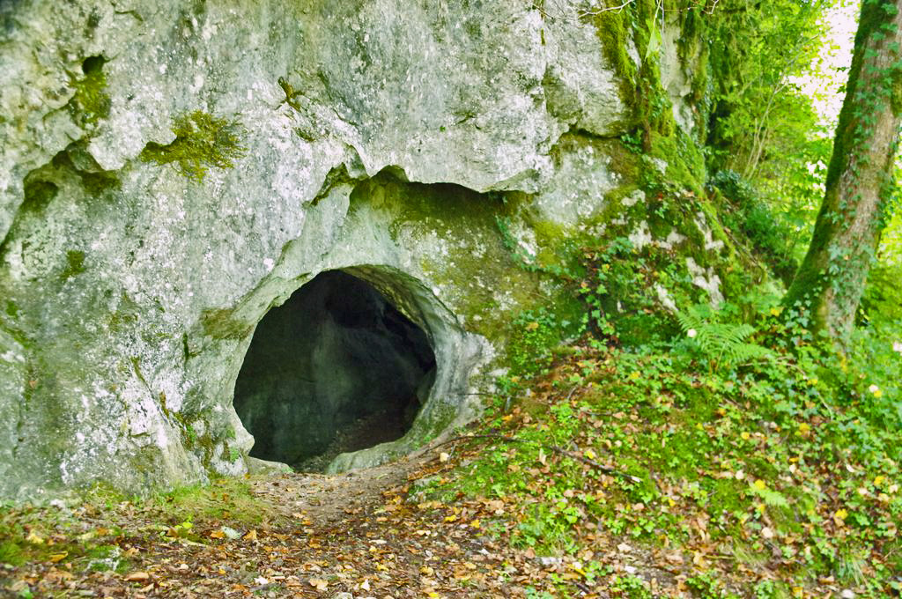
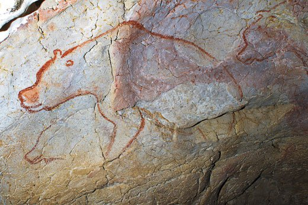
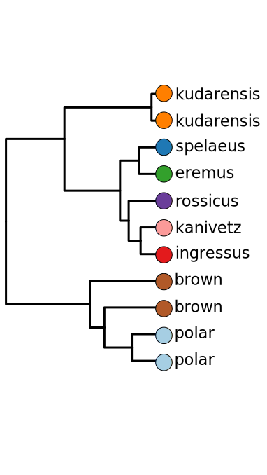
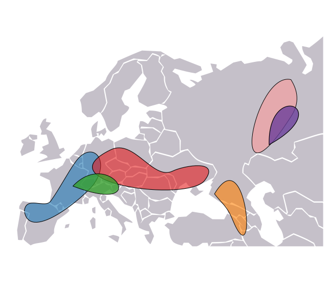
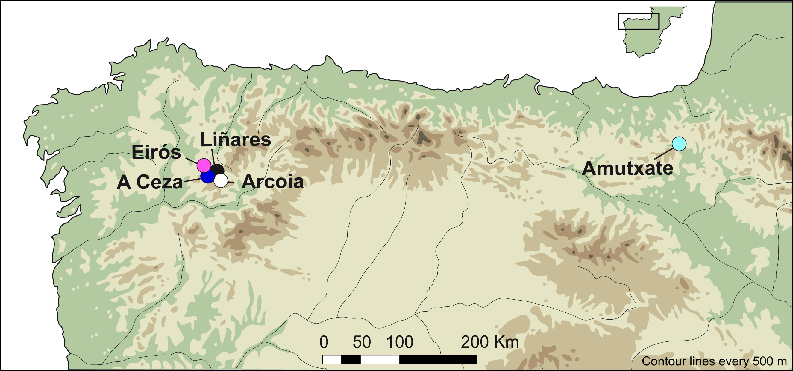
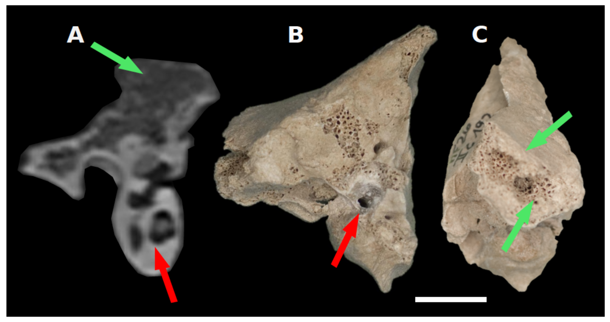
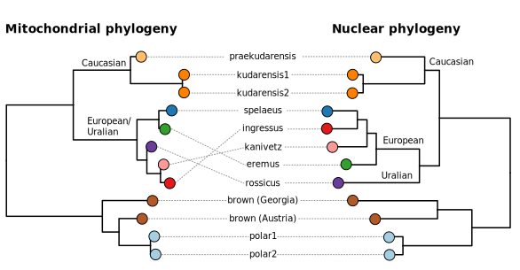
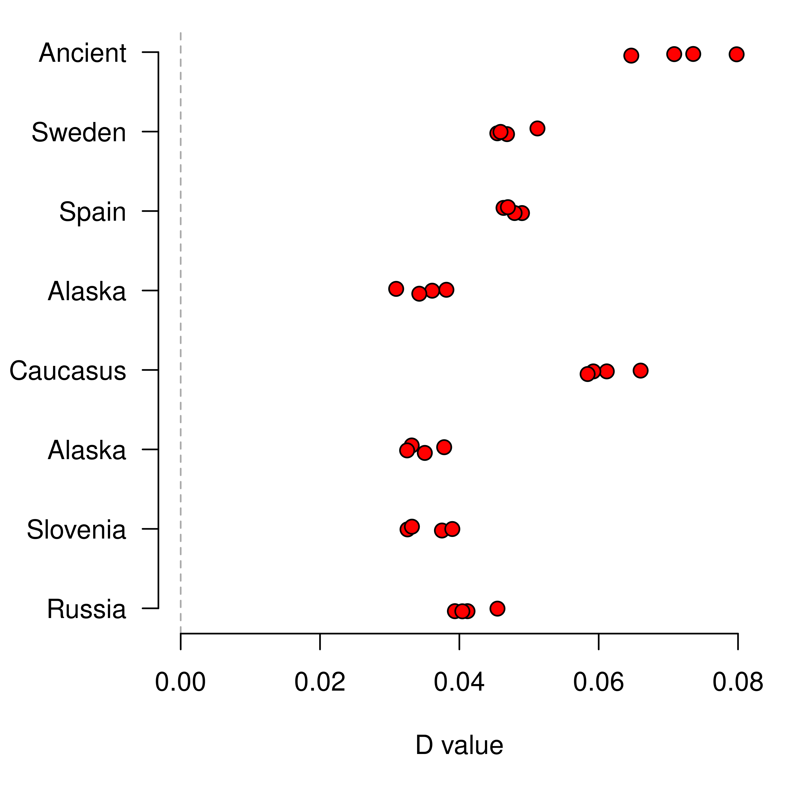

<!-- adding bold and italic options -->

## Discoveries facilitated by ancient DNA

- Cave bear homing behaviour
- Cave bear phylogeny
- Cave bear admixture

--- .segue .dark 

## Cave bear!

--- &twocol

## Cave bears (*Ursus spelaeus* complex)

*** =left

*Sergiodlarosa, CC BY-SA 3.0*

*** =right

*Rama pour Wikimédia France, CC BY-SA 2.0 FR*

--- &twocol

## Cave bear caves

*** =left

*PierreG 09, CC BY-SA 4.0*

*** =right

*Ermell, CC BY-SA 4.0*

--- &thirds

## Cave bear caves

*** =right

*Zátonyi Sándor, (ifj.) Fizped, CC BY-SA 3.0*

*** =left

*JYB Devot, CC BY-SA 4.0*

--- &twocol

## Cave bears and humans

*** =left

*Late Pleistocene human*

*** =right

*Didier Descouens, CC BY-SA 4.0*

--- bg:white

## Cave bear mitochondrial phylogeny

--- &thirds

## Cave bear mitochondrial phylogeny

*** =left

*** =right

--- .segue .dark 

## Homing behaviour

---

## Cave bears in northern Spain

- 5 caves
- 4 are within a few kms
- 26 cave bear mitochondrial genomes generated using hybridisation capture
- Some have radiocarbon dates

---

## Mitochondrial phylogeny

---

## Haplotype network

---

## Tip dating

- Radiocarbon dates, estimate sub rate and coalescence times

---

## Date of cave occupation

---

## Interpretation

>- Each cave contains (more or less) its own mitochondrial lineage
>- No geographic barriers preventing movement between caves
>- Caves occupied simultaneously
>- Mitochondrial DNA inherited through maternal line
>- Female bears give birth in the caves
>- **A single intermixing population of cave bears, returning to the cave where they were born for hibernation**

--- .segue .dark 

## Cave bear phylogeny

--- &thirds

## Cave bear mitochondrial phylogeny

*** =left

*** =right

---

## Disadvantages

- **A single genetic locus**
- Essentially a single piece of evidence
- Incomplete lineage sorting (retention of ancestral variants)
- Mitochondrial transfer

## Solution: need more genetic loci

- Nuclear genome, thousands of loci
- Massively increased statistical power

---

## Example: brown bears and polar bears

<embed src="./assets/img/Miller et al. - 2012 - Polar and brown bear genomes reveal ancient admixture and demographic footprints of past climate change.pdf" title="plot of chunk unnamed-chunk-23" width="100%" height="500" type="application/pdf" />

--- &twocol

## Cave bear genome sequencing

*** =left

*Anatomography CC BY-SA 2.1 JP*

*** =right

--- &vcenter

## Cave bear genome sequencing

--- &vcenter

## Pseudohaploid genome data

--- .class #id

## Error reduction

--- .class #id

## Cave bear nuclear phylogeny

--- &twocol bg:white

## Middle Pleistocene cave bear genome

**360,000 year old cave bear from Caucasus Mountains**

*** =left

*** =right

--- @vcenter

## Calibrated nuclear genome phylogeny

--- .segue .dark 

## Cave bear admixture

---

## Brown bears

Cave bears coexisted with brown bears for much of their evolutionary history

--- &thirds bg:white

## Admixture with brown bears

*** =left

*** =right

---

## Direction of gene flow

--- @vcenter

## Calibrated nuclear genome phylogeny

---

## Summary

- cave bear homing behavior
- Pervasive mito-nuclear discordance
- Evidence of mitochondrial transfer
- Divergence times of species and taxa
- Admixture with brown bears and among cave bears

--- &thankyou

## That's all folks!
